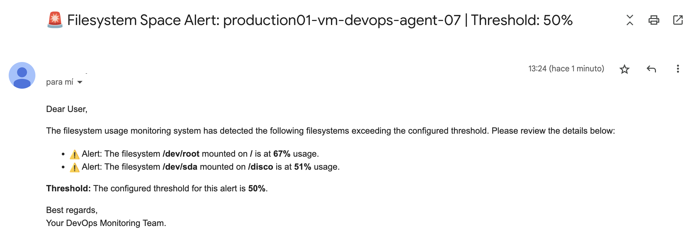

# **Filesystem Monitor Space**

## Overview

**Filesystem Monitor Space** is a simple and efficient Node.js application designed to monitor disk usage on Linux systems. It sends email alerts when the usage of any monitored filesystem exceeds a specified threshold. Additionally, it can be combined with **cron** or other scheduling tools to run automatically at defined intervals.

## **Example of the email notification**:



## **Prerequisites**

- **Node.js**: Version 18 or higher.
- **SMTP Server**: Required to send email notifications.

## **Installation and Usage**

1. **Clone the repository**:

   ```bash
   git clone https://github.com/peperiqueelmee/filesystem-monitor.git
   ```

2. **Navigate to the project directory**:

   ```bash
   cd filesystem-monitor
   ```

3. **Install dependencies**:

   ```bash
   npm install
   ```

4. **Configure environment variables**:

   - Create a `.env` file in the project's root directory.
   - Use `example.env` as a reference to define the required variables:

     ```bash
     # Monitoring Configuration
     THRESHOLD=           # Disk usage threshold in percentage to trigger alerts (default value: 75)

     EXCLUDE_LIST=        # List of filesystems to exclude from monitoring (format: filesystem1|filesystem2)

     # SMTP Configuration
     SMTP_HOST=           # SMTP server address
     SMTP_PORT=           # SMTP server port
     SMTP_USER=           # User to authenticate with the SMTP server
     SMTP_PASS=           # Password to authenticate with the SMTP server
     MAIL_TO=             # Email address to send alerts
     ```

5. **Run the program**:
   ```bash
   node src/app.js
   ```
